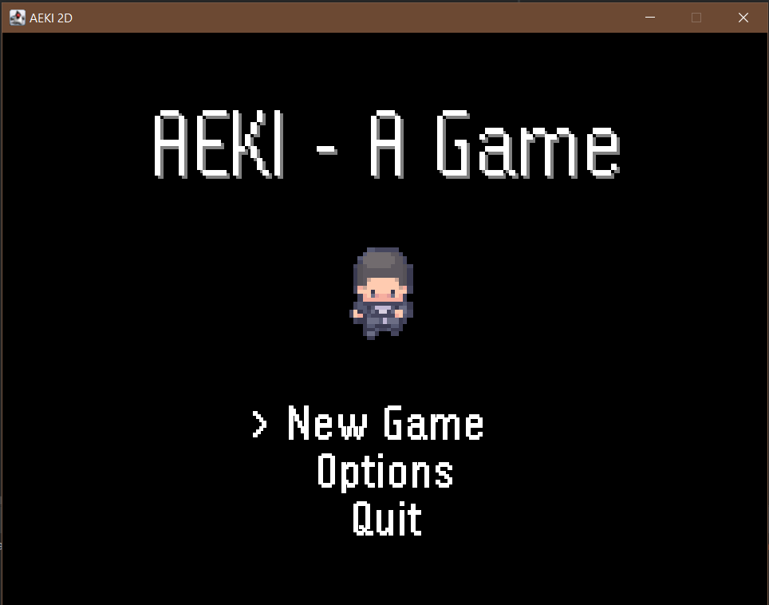
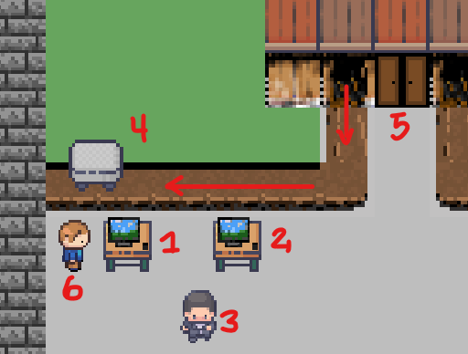
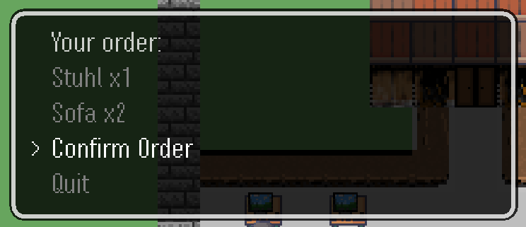
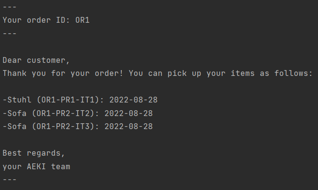
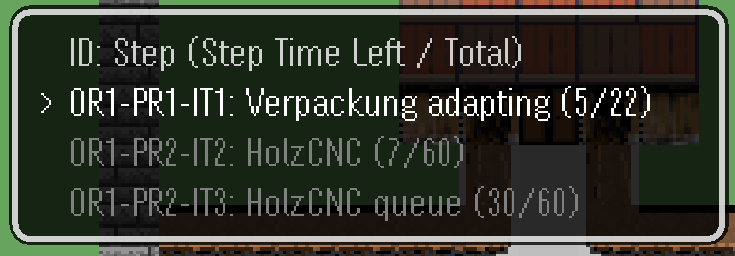
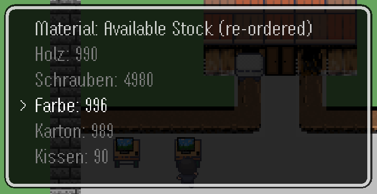
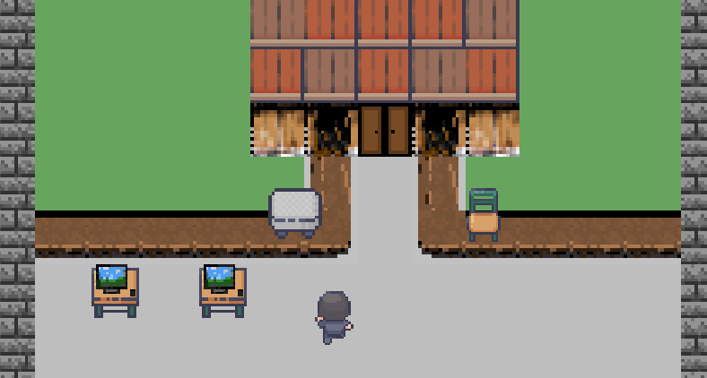
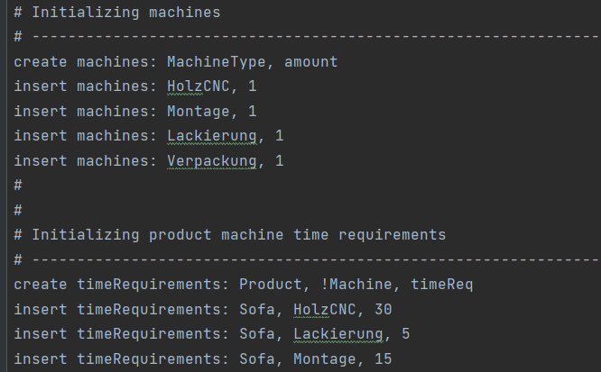

# AEKI Smart Manufacturing

For the course Business Innovation Fundamentals at the University of St. Gallen, I had to create a simple smart manufacturing company. The course is part of the core curriculum of the MBI and is meant to serve as an introduction to programming in Java. Here is a quick overview over the task and the proposed solution. It's nothing too crazy, but it's been a lot of fun and served as a nice introduction into both Java and game-development in general.

## Problem

Our task was to create a simple system that would allow for the user to order products (no UI necessary). These products should then be "produced" (taking a certain amount of time and resources). In case of a shortage of resources, the system should be able to inform the user and/or reorder new resources. Furthermore, the user should get a confirmation for their order.

## Approach

### Movement and interactions

The user can move their character (3) by using `AWSD` and interact with NPCs (e.g. 6) or objects using `space`. The two main objects to interact with are the customer PC (1) and the manager PC (2).

On the customer PC the user can go through a menu with dynamically created options and order their products. 

Once the order is created, the user is sent a confirmation with the pick-up time for their items. In case of a shortage of resources, the pick-up time is delayed and the system reorders new resources.

### Production

On the manager PC the user can see the current status of the manufacturing process and the remaining time (step/total) for each ordered product.

Furthermore, the user can check the current amount of resources available. And if a there were any re-orders.

Currently, the user can order chairs and sofas. Once all production steps are done, the items can be seen on the assembly line.

### Backend and Database

One thing that was particularly fun was to create a simple database to store the recipes for the products, the initial stock, etc. For that purpose, I created a simple, somewhat SQL inspired language that can read and write to a text file (`./db.csv`).

### Game Engine

Since I've never done any game-development before, I decided that I would write my own (rather simple) engine, so I'd get a better feeling for how that all works. 